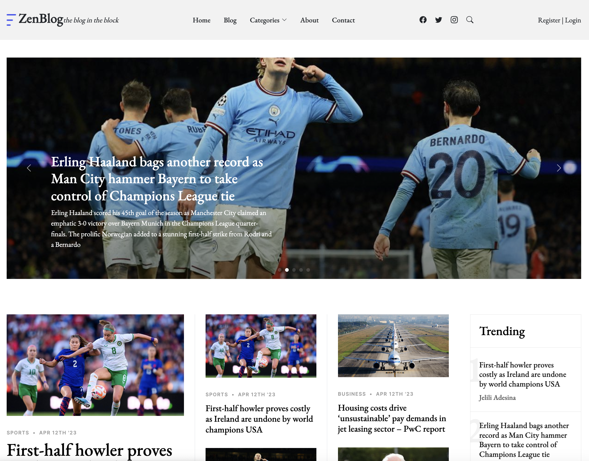

# ZenBlog - Node, Express and MongoDB

A news blog with content management functionalities developed using Node, Express and MongoDB.



## Table of Contents

- [ZenBlog - Node, Express and MongoDB](#zenblog---node-express-and-mongodb)
  - [Table of Contents](#table-of-contents)
  - [Technologies](#technologies)
  - [Installation](#installation)
  - [Usage](#usage)
    - [Development](#development)
    - [Production](#production)
  - [License](#license)

## Technologies

- JavaScript
- Node
- Express
- MongoDB
- Passport
- Cloudinary

## Installation

1. Clone the repository:

```bash
 git clone https://github.com/jelilio/zenblog.git
```

2. Install dependencies:

```bash
 npm install
```

## Usage

### Development

1. Setup .env file in the project directory and provide the below properties
   ```properties
   PORT=<port>
   DEVELOPMENT_DB_DSN=<mongodb url>
   DEVELOPMENT_CLOUDINARY_CLOUD_NAME=<cloudinary environment name>
   DEVELOPMENT_CLOUDINARY_API_KEY=<cloudinary api key>
   DEVELOPMENT_CLOUDINARY_API_SECRET=<cloudinary api secret>
   ```
2. Run the below command
   To run the project in development, use the following command:
   ```bash
   npm run dev
   ```

### Production

1. Provide the below key-value properties
   ```properties
   PORT=<port>
   PRODUCTION_DB_DSN=<mongodb url>
   PRODUCTION_CLOUDINARY_CLOUD_NAME=<cloudinary environment name>
   PRODUCTION_CLOUDINARY_API_KEY=<cloudinary api key>
   PRODUCTION_CLOUDINARY_API_SECRET=<cloudinary api secret>
   ```
2. To run the project in production, use the below command:
   ```bash
   npm run start
   ```

## License

This project is licensed under the [MIT License](LICENSE).
